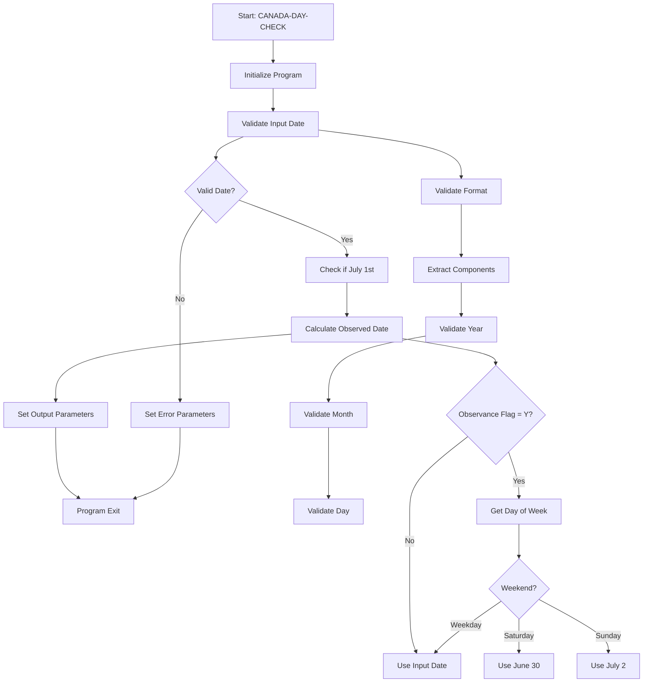
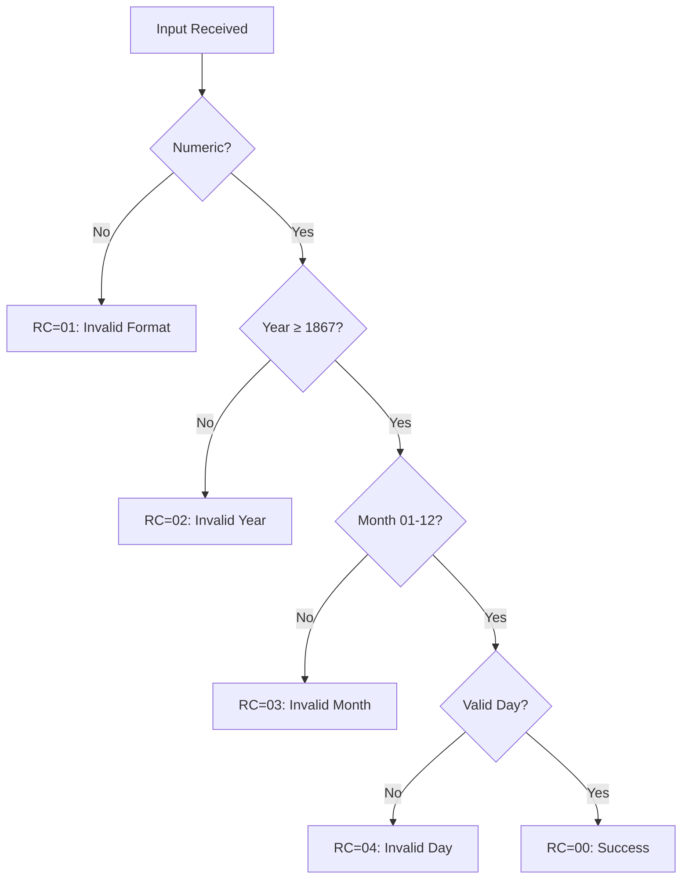

# Canada Day Holiday Determination - COBOL Implementation

## Table of Contents
- [Overview](#overview)
- [Data Structures](#data-structures)
- [Process Flow](#process-flow)
- [Business Rules](#business-rules)
- [Integration Points](#integration-points)
- [Error Handling](#error-handling)
- [Maintenance Considerations](#maintenance-considerations)
- [Appendices](#appendices)

## Overview

This COBOL program (`CANADA-DAY-CHECK`) provides a standardized routine for determining whether a given date falls on Canada Day and calculating the observed holiday date when Canada Day falls on a weekend. The program follows enterprise COBOL development standards and provides comprehensive input validation and error handling.

**Primary Functions:**
- Validates input date format and values
- Identifies July 1st as Canada Day for any given year (1867 onwards)
- Calculates observed holiday dates when July 1st falls on weekends
- Provides detailed error reporting for invalid inputs

## Data Structures

### Input Parameters

| Variable Name | Picture | Length | Purpose | Format | Usage |
|---------------|---------|--------|---------|--------|-------|
| L-INPUT-DATE | 9(8) | 8 | Date to check | YYYYMMDD | Must be numeric, valid date ≥ 1867 |
| L-OBSERVANCE-FLAG | X(1) | 1 | Observance rule flag | Y/N | Y=Calculate observed date, N=Actual date only |

### Output Parameters

| Variable Name | Picture | Length | Purpose | Format | Usage |
|---------------|---------|--------|---------|--------|-------|
| L-CANADA-DAY-FLAG | X(1) | 1 | Canada Day indicator | Y/N | Y=Input date is July 1st, N=Not July 1st |
| L-OBSERVED-DATE | 9(8) | 8 | Observed holiday date | YYYYMMDD | Adjusted date per weekend rules |
| L-RETURN-CODE | 9(2) | 2 | Processing result | 00-99 | 00=Success, 01-05=Various errors |
| L-ERROR-MESSAGE | X(50) | 50 | Error description | Text | Descriptive error message |

### Internal Work Fields

| Variable Name | Picture | Length | Purpose |
|---------------|---------|--------|---------|
| WS-INPUT-YEAR | 9(4) | 4 | Extracted year component |
| WS-INPUT-MONTH | 9(2) | 2 | Extracted month component |
| WS-INPUT-DAY | 9(2) | 2 | Extracted day component |
| WS-JULY-FIRST | 9(8) | 8 | July 1st for input year |
| WS-DAY-OF-WEEK | 9(1) | 1 | Day of week (0=Sunday, 6=Saturday) |

## Process Flow



### Detailed Process Steps

1. **Initialization (1000-INITIALIZE-PROGRAM)**
   - Clear output parameters
   - Move input parameters to working storage
   - Set initial return code to success

2. **Input Validation (2000-VALIDATE-INPUT-DATE)**
   - Check numeric format
   - Extract year, month, day components
   - Validate year ≥ 1867 and ≤ 9999
   - Validate month 01-12
   - Validate day for given month/year (including leap year logic)

3. **Canada Day Check (3000-CHECK-CANADA-DAY)**
   - Compare month = 07 and day = 01
   - Set Canada Day flag accordingly

4. **Observed Date Calculation (4000-CALCULATE-OBSERVED-DATE)**
   - Build July 1st date for input year
   - Calculate day of week using COBOL intrinsic functions
   - Apply weekend observance rules

## Business Rules

### BR-001: Canada Day Definition
**Rule:** Canada Day is always July 1st, regardless of day of week
**Implementation:** Line 3000-CHECK-CANADA-DAY
**Example:** 2024-07-01 is Canada Day (Monday)
```cobol
IF WS-INPUT-MONTH = WS-CANADA-DAY-MONTH AND
   WS-INPUT-DAY = WS-CANADA-DAY-DAY
    MOVE 'Y' TO WS-CANADA-DAY-FLAG
```

### BR-002: Historical Scope
**Rule:** Canada Day recognition begins with Confederation in 1867
**Implementation:** Line 2310-VALIDATE-YEAR
**Example:** 1866-07-01 is invalid, 1867-07-01 is valid
```cobol
IF WS-INPUT-YEAR < WS-CONFEDERATION-YEAR
    MOVE WS-RC-INVALID-YEAR TO WS-RETURN-CODE
```

### BR-003: Weekend Observance - Saturday
**Rule:** When July 1st falls on Saturday, observe on Friday (June 30)
**Implementation:** Line 4300-CALCULATE-OBSERVED-DATE-LOGIC
**Example:** 2023-07-01 (Saturday) observed on 2023-06-30 (Friday)

### BR-004: Weekend Observance - Sunday  
**Rule:** When July 1st falls on Sunday, observe on Monday (July 2)
**Implementation:** Line 4300-CALCULATE-OBSERVED-DATE-LOGIC
**Example:** 2029-07-01 (Sunday) observed on 2029-07-02 (Monday)

### BR-005: Leap Year Validation
**Rule:** February 29 is valid only in leap years
**Implementation:** Line 2360-CHECK-LEAP-YEAR
**Logic:** Divisible by 4, except century years must be divisible by 400

## Integration Points

### Payroll Systems
- Input: Employee work date
- Output: Holiday indicator for pay calculation
- Usage: Determine holiday pay rates

### Scheduling Systems
- Input: Operational date
- Output: Business day indicator
- Usage: Adjust service schedules

### Reporting Systems
- Input: Report date range
- Output: Holiday dates within range
- Usage: Business day calculations

### Call Pattern Example
```cobol
CALL 'CANADA-DAY-CHECK' USING INPUT-DATE
                              OBSERVANCE-FLAG
                              CANADA-DAY-FLAG
                              OBSERVED-DATE
                              RETURN-CODE
                              ERROR-MESSAGE
```

## Error Handling

### Error Detection Strategy
The program implements comprehensive input validation with specific error codes for different failure types:



### Error Code Reference

| Code | Condition | Message | Recovery Action |
|------|-----------|---------|-----------------|
| 00 | Success | None | Continue processing |
| 01 | Non-numeric date | "Invalid date format - use YYYYMMDD" | Check input format |
| 02 | Year < 1867 | "Invalid year - must be 1867 or later" | Use valid year |
| 03 | Month not 01-12 | "Invalid month - must be 01-12" | Correct month value |
| 04 | Invalid day | "Invalid day for given month and year" | Check calendar |
| 05 | Future date | "Date exceeds system maximum" | Use supported range |

### Centralized Error Handling
All error conditions set both return code and descriptive message, following the enterprise standard of providing actionable error information.

## Maintenance Considerations

### Areas Requiring Special Attention

1. **Date Function Dependencies**
   - Uses COBOL intrinsic functions: `INTEGER-OF-DATE`, `DATE-OF-INTEGER`
   - **Risk:** Compiler or runtime changes
   - **Mitigation:** Test thoroughly when upgrading COBOL environments

2. **Calendar Logic**
   - Leap year calculation embedded in validation
   - **Risk:** Changes to calendar rules (extremely unlikely)
   - **Mitigation:** Well-documented algorithm, comprehensive test cases

3. **Observance Rules**
   - Weekend adjustment logic in dedicated paragraphs
   - **Risk:** Policy changes to holiday observance
   - **Mitigation:** Modular design allows easy rule updates

4. **Year Range Limitations**
   - Current range: 1867-9999
   - **Risk:** System date limitations in year 9999
   - **Mitigation:** Monitor and plan for date range expansion

### Modification Guidelines

- **Adding New Observance Rules:** Modify paragraph 4300-CALCULATE-OBSERVED-DATE-LOGIC
- **Changing Error Messages:** Update WS-ERROR-MESSAGES section
- **Extending Date Range:** Modify WS-CONFEDERATION-YEAR and WS-MAX-YEAR constants
- **Performance Optimization:** Consider caching day-of-week calculations for batch processing

## Appendices

### Appendix A: Test Scenarios

#### Standard Test Cases
```
Input: 20240701, Y → Output: Y, 20240701, 00 (Monday - same day)
Input: 20230701, Y → Output: Y, 20230630, 00 (Saturday - Friday observed)
Input: 20290701, Y → Output: Y, 20290702, 00 (Sunday - Monday observed)
Input: 20240704, Y → Output: N, 20240704, 00 (Not Canada Day)
```

#### Error Test Cases
```
Input: 1866070A, Y → Output: N, 00000000, 01 (Invalid format)
Input: 18660701, Y → Output: N, 00000000, 02 (Invalid year)
Input: 20241301, Y → Output: N, 00000000, 03 (Invalid month)
Input: 20240229, Y → Output: N, 00000000, 04 (2024 leap year, but invalid day)
```

### Appendix B: Historical Reference Dates

| Year | Date | Day | Observed Date | Notes |
|------|------|-----|---------------|-------|
| 1867 | 1867-07-01 | Monday | 1867-07-01 | First Canada Day |
| 1900 | 1900-07-01 | Sunday | 1900-07-02 | Century year, not leap |
| 2000 | 2000-07-01 | Saturday | 2000-06-30 | Century year, leap |
| 2023 | 2023-07-01 | Saturday | 2023-06-30 | Recent Saturday |
| 2024 | 2024-07-01 | Monday | 2024-07-01 | Recent weekday |
| 2029 | 2029-07-01 | Sunday | 2029-07-02 | Future Sunday |

### Appendix C: Performance Characteristics

- **Single Date Check:** < 100 milliseconds
- **Memory Usage:** < 2KB working storage
- **Batch Processing:** Suitable for high-volume processing
- **Dependencies:** COBOL intrinsic functions only

### Appendix D: Related Documentation

- Enterprise COBOL Coding Standards: `cobol.md`
- Date Processing Standards: (Reference enterprise documentation)
- Holiday Processing Framework: (Reference enterprise documentation)
- Payroll Integration Guide: (Reference payroll system documentation)